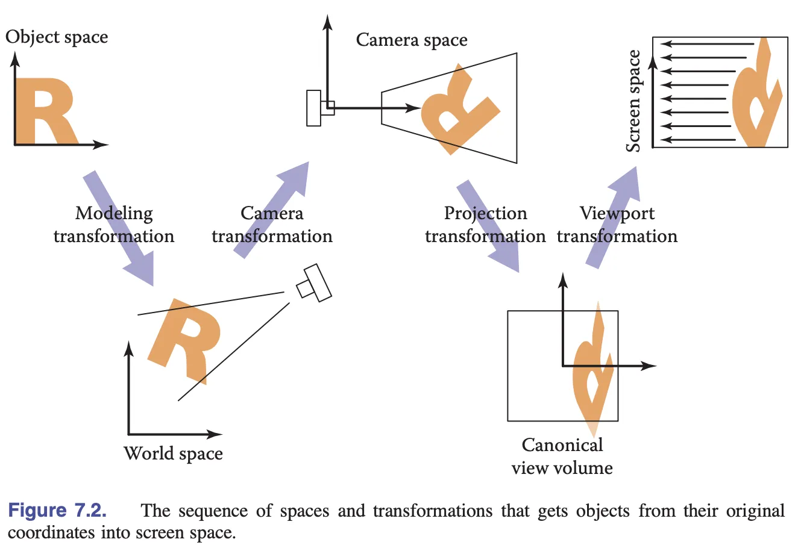
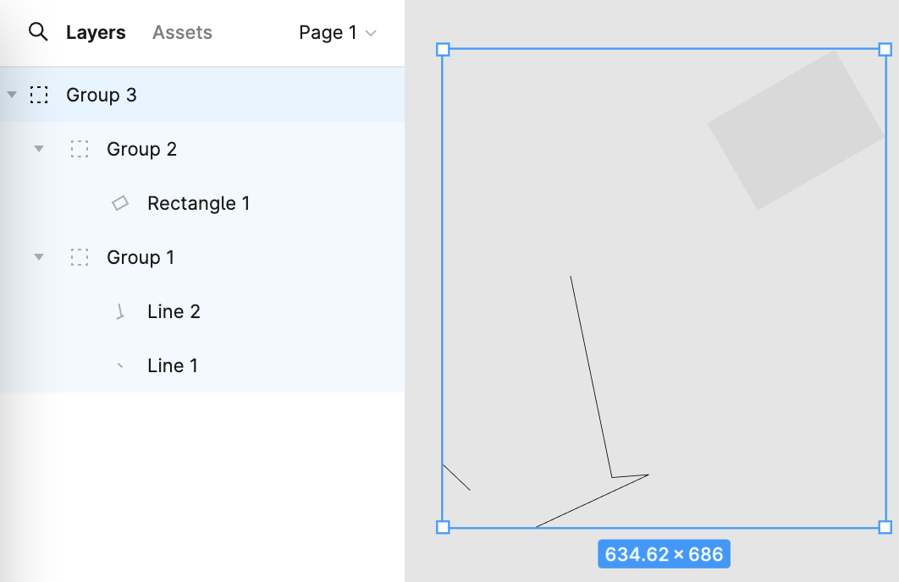

# 课程 3 - 场景图和变换

上一节课中我们绘制了一个圆，在这节课中你将学习到以下内容：

-   变换。让图形支持平移、缩放、旋转、斜切变换。
-   场景图。

最后我们利用以上特性实现一个简单的“太阳系”模型。

```js eval code=false
(async () => {
    const { Canvas, Circle, Group } = Lesson3;

    const [$canvas, canvas] = await Utils.createCanvas(Canvas, 400, 400);

    const solarSystem = new Group();
    const earthOrbit = new Group();
    const moonOrbit = new Group();

    const sun = new Circle({
        cx: 0,
        cy: 0,
        r: 100,
        fill: 'red',
    });
    const earth = new Circle({
        cx: 0,
        cy: 0,
        r: 50,
        fill: 'blue',
    });
    const moon = new Circle({
        cx: 0,
        cy: 0,
        r: 25,
        fill: 'yellow',
    });
    solarSystem.appendChild(sun);
    solarSystem.appendChild(earthOrbit);
    earthOrbit.appendChild(earth);
    earthOrbit.appendChild(moonOrbit);
    moonOrbit.appendChild(moon);

    solarSystem.position.x = 200;
    solarSystem.position.y = 200;
    earthOrbit.position.x = 100;
    moonOrbit.position.x = 100;

    canvas.appendChild(solarSystem);

    let id;
    const animate = () => {
        solarSystem.rotation += 0.01;
        earthOrbit.rotation += 0.02;
        canvas.render();
        id = requestAnimationFrame(animate);
    };
    animate();

    unsubscribe(() => {
        cancelAnimationFrame(id);
        canvas.destroy();
    });
    return $canvas;
})();
```

## 变换

[CSS Transform] 提供了 `translate` `scale` `rotate` `skew` 等变换。
关于这些变换背后对应的矩阵可以参考：[Transformations - LearnOpenGL]。由于我们的场景中只包含 2D 图形，因此仅需要 3x3 的矩阵，由于最后一行 `[0, 0, 1]` 都是固定的，实际上只需要存储矩阵中的 6 个元素：

```bash
| a | c | tx|
| b | d | ty|
| 0 | 0 | 1 |
```

我们直接使用 [@pixi/math] 给我们的图形基类增加一个 `transform` 属性，当然也可以选择 [gl-matrix]。

```ts
import { Transform } from '@pixi/math';

export abstract class Shape {
    transform = new Transform();
}
```

在增加更多方法前，我们先介绍一个重要的概念。

### 局部和世界坐标系

坐标系可以用来描述场景中物体的位置、旋转和缩放情况，最著名的坐标系是欧式坐标系。在图形学中我们还会使用到重心坐标系。欧式空间可以包含 N 维，这里我们只使用二维空间。

当我们在说“月亮绕着地球转”的时候，实际上已经忽略了地球以外的对象。在月亮的局部坐标系中，它只是单纯地绕着一个点旋转而已，尽管在整个太阳系这个世界坐标系下，地球还在绕着太阳旋转，月球最终沿着上面那个复杂轨迹运动。

在二维和三维世界中，都可以使用局部坐标系和世界坐标系的概念，下图来自 [playcanvas]，左侧为世界坐标系，你可以看到坐标轴是始终不变的。右侧展示的是立方体的局部坐标系，它的坐标轴随物体变换（这里是旋转）而改变，因此如果此时这个旋转后的物体发生了 X 轴（红色）正向的平移，它可能就跑地底下去了。


世界坐标系被整个场景图内的所有节点共享，因此它有一个固定的原点`(0, 0)`，XYZ 三轴（二维场景中为 XY 轴）的朝向也都是固定的，即使场景中的这个盒子自身发生了旋转，世界坐标系对它来说也不会变化。但对于自身的局部坐标系而言，它的原点首先就不再是 `(0, 0)` 而是物体自身的位置，坐标轴自然也发生了变化，顾名思义它和物体本身相关联。

试想此时我们让这个盒子“沿 X 轴（红色）平移 10 个单位”，在不同坐标系下含义完全不同。因此当我们想对一个物体进行变换时，首先要指明所处的坐标系。

另外，局部坐标系也被称作**模型坐标系**，在描述模型自身的变换时更方便。下图中放置了两个士兵模型，如果我们想让每一个士兵转一下头，显然在局部坐标系做比较简单，因为“转动”这个变换就是相对于每个模型的头部而言的。 

我们为图形基类增加局部和世界坐标系下变换的方法，在 [@pixi/math] 中已经提供：

```ts
export abstract class Shape {
    get localTransform(): Matrix {
        return this.transform.localTransform;
    }
    get worldTransform(): Matrix {
        return this.transform.worldTransform;
    }
}
```

下图来自 [Fundamentals of Computer Graphics 4th Edition]，展示了局部（对象）坐标系经过模型变换，转到了世界坐标系，接着通过相机变换转换到了相机坐标系，再通过投影变换进入裁剪坐标系（clip space/NDC），最后通过视口变换进入屏幕坐标系（screen/pixel space）。后续我们会介绍相机，现在我们只需要关心模型变换。



接下来我们需要将模型变换矩阵传入 Shader 中对顶点位置进行变换。

### 对齐问题

在 Vertex Shader 中模型变换矩阵通过 Uniform 传入，然后与位置向量左乘：

```glsl
layout(std140) uniform ShapeUniforms {
  mat3 u_ModelMatrix;
};

vec2 position = (u_ModelMatrix * vec3(a_Position + a_Size * a_FragCoord, 1)).xy;
```

很自然的，我们直接创建一个长度为 9（3 \* 3 的矩阵） 的 `Float32Array`：

```ts
this.#uniformBuffer = device.createBuffer({
    viewOrSize: Float32Array.BYTES_PER_ELEMENT * 9, // mat3
    usage: BufferUsage.UNIFORM,
    hint: BufferFrequencyHint.DYNAMIC,
});
```

但此时控制台会报错，认为我们创建的 Uniform Buffer 长度不够，这是怎么回事呢？

```bash
[.WebGL-0x10800c78f00] GL_INVALID_OPERATION: It is undefined behaviour to use a uniform buffer that is too small.
```

这里需要引入 [Memory layout] 的概念，Uniform Block 支持 `packed` `shared` `std140` `std430` 这些布局规则。不同的布局规则会导致存储和读取 Buffer 中数据方式的不同。我们这里选择 `std140`，优点是不同 Program 间不存在布局差异（相较 `packed`），不同 OpenGL 实现间也不存在差异（相较 `shared`），缺点就是需要手动处理对齐问题，官网文档也给出了这样的警告，提醒我们应当尽量避免使用 `vec3` 以规避对齐问题：

> Warning: Implementations sometimes get the std140 layout wrong for vec3 components. You are advised to manually pad your structures/arrays out and avoid using vec3 at all.

那么什么是对齐呢？我们以 `vec3` 为例，长度为 `4 * 3` Bytes 但它实际占用的是 16。实际使用中对齐规则非常复杂，这里的 `mat3` 实际需要 `4 * 12` Bytes 的存储空间：

```ts
this.#uniformBuffer = device.createBuffer({
    viewOrSize: Float32Array.BYTES_PER_ELEMENT * 12, // mat3
    usage: BufferUsage.UNIFORM,
});
```

在写入数据时我们需要手动添加 padding：

```bash
| a | c | tx|
| b | d | ty|
| 0 | 0 | 1 |
| padding | padding | padding |
```

```ts
const PADDING = 0;
const { a, b, c, d, tx, ty } = this.worldTransform;
this.#uniformBuffer.setSubData(
    0,
    new Uint8Array(
        new Float32Array([
            a,
            b,
            0,
            PADDING,
            c,
            d,
            0,
            PADDING,
            tx,
            ty,
            1,
            PADDING,
        ]).buffer,
    ),
);
```

值得一提的是 WGSL 中也有同样的 [Alignment of Uniform and Storage buffers]，在 Rust 生态中有 [bytemuck] 帮助自动处理对齐问题，下面的例子来自 [bevy]：

```rust
use bytemuck::{Pod, Zeroable};

#[repr(C)]
#[derive(Copy, Clone, Pod, Zeroable)]
pub struct UiMaterialVertex {
    pub position: [f32; 3],
    pub uv: [f32; 2],
    pub border_widths: [f32; 4],
}
```

下面我们为图形添加平移、缩放、旋转等变换 API。

### 平移

首先是 [WebGL 2D Translation]：

```ts
export abstract class Shape {
    get position(): ObservablePoint {
        return this.transform.position;
    }
    set position(value: IPointData) {
        this.transform.position.copyFrom(value);
    }

    get x(): number {
        return this.position.x;
    }
    set x(value: number) {
        this.transform.position.x = value;
    }

    get y(): number {
        return this.position.y;
    }
    set y(value: number) {
        this.transform.position.y = value;
    }
}
```

用法和 PIXI.js 保持一致：

```js eval code=false
circle = call(() => {
    const { Circle } = Lesson3;
    return new Circle({
        cx: 100,
        cy: 100,
        r: 50,
        fill: 'red',
    });
});
```

```js eval code=false
positionX = Inputs.range([0, 100], { label: 'position.x', value: 0, step: 1 });
```

```js eval code=false
positionY = Inputs.range([0, 100], { label: 'position.y', value: 0, step: 1 });
```

```js eval
call(() => {
    circle.position.x = positionX;
    circle.position.y = positionY;
});
```

```js eval code=false
(async () => {
    const { Canvas } = Lesson3;

    const [$canvas, canvas] = await Utils.createCanvas(Canvas, 200, 200);

    canvas.appendChild(circle);

    let id;
    const animate = () => {
        canvas.render();
        id = requestAnimationFrame(animate);
    };
    animate();

    unsubscribe(() => {
        cancelAnimationFrame(id);
        canvas.destroy();
    });
    return $canvas;
})();
```

### 旋转

旋转、缩放和斜切都需要指定变换中心，类似 CSS 中的 `transform-origin`：

```ts
export abstract class Shape {
    get pivot(): ObservablePoint {
        return this.transform.pivot;
    }
    set pivot(value: IPointData) {
        this.transform.pivot.copyFrom(value);
    }
}
```

```ts
export abstract class Shape {
    get rotation(): number {
        return this.transform.rotation;
    }
    set rotation(value: number) {
        this.transform.rotation = value;
    }
}
```

```js eval code=false
circle2 = call(() => {
    const { Circle } = Lesson3;
    return new Circle({
        cx: 0,
        cy: 0,
        r: 50,
        fill: 'red',
    });
});
```

```js eval code=false
pivotX = Inputs.range([0, 100], { label: 'pivot.x', value: 0, step: 1 });
```

```js eval code=false
pivotY = Inputs.range([0, 100], { label: 'pivot.y', value: 0, step: 1 });
```

```js eval
call(() => {
    circle2.pivot.x = pivotX;
    circle2.pivot.y = pivotY;
});
```

```js eval code=false
(async () => {
    const { Canvas } = Lesson3;

    const [$canvas, canvas] = await Utils.createCanvas(Canvas, 200, 200);

    canvas.appendChild(circle2);

    let id;
    const animate = () => {
        circle2.rotation += 0.01;
        canvas.render();
        id = requestAnimationFrame(animate);
    };
    animate();

    unsubscribe(() => {
        cancelAnimationFrame(id);
        canvas.destroy();
    });
    return $canvas;
})();
```

### 缩放

```ts
export abstract class Shape {
    get scale(): ObservablePoint {
        return this.transform.scale;
    }
    set scale(value: IPointData) {
        this.transform.scale.copyFrom(value);
    }
}
```

```js eval code=false
circle3 = call(() => {
    const { Circle } = Lesson3;
    return new Circle({
        cx: 0,
        cy: 0,
        r: 50,
        fill: 'red',
    });
});
```

```js eval code=false
pivotX2 = Inputs.range([0, 100], { label: 'pivot.x', value: 0, step: 1 });
```

```js eval code=false
pivotY2 = Inputs.range([0, 100], { label: 'pivot.y', value: 0, step: 1 });
```

```js eval code=false
scaleX = Inputs.range([0, 5], { label: 'scale.x', value: 1, step: 0.1 });
```

```js eval code=false
scaleY = Inputs.range([0, 5], { label: 'scale.y', value: 1, step: 0.1 });
```

```js eval
call(() => {
    circle3.pivot.x = pivotX2;
    circle3.pivot.y = pivotY2;
    circle3.scale.x = scaleX;
    circle3.scale.y = scaleY;
    circle3.position.x = 100;
    circle3.position.y = 100;
});
```

```js eval code=false
(async () => {
    const { Canvas } = Lesson3;

    const [$canvas, canvas] = await Utils.createCanvas(Canvas, 200, 200);

    canvas.appendChild(circle3);

    let id;
    const animate = () => {
        canvas.render();
        id = requestAnimationFrame(animate);
    };
    animate();

    unsubscribe(() => {
        cancelAnimationFrame(id);
        canvas.destroy();
    });
    return $canvas;
})();
```

### 斜切

```ts
export abstract class Shape {
    get skew(): ObservablePoint {
        return this.transform.skew;
    }
    set skew(value: IPointData) {
        this.transform.skew.copyFrom(value);
    }
}
```

## SceneGraph

[SceneGraph] 是组织和管理二维/三维虚拟场景的一种数据结构，是一个有向无环图。场景图提供了两大能力：

1. 描述父子关系
2. 自动完成基于父子关系的某些复杂级联计算

在 Figma 中左侧面板就展示了场景图：



试想我们需要构建一个简单的太阳系场景，具有以下层次关系：

```bash
太阳系 solarSystem
   |    |
   |   太阳 sun
   |
 地球轨道 earthOrbit
   |    |
   |  地球 earth
   |
 月球轨道 moonOrbit
      |
     月球 moon
```

使用这样的 API 描述，其中 `Group` 只是简单继承了图形基类，并不需要重载渲染方法：

```ts
const solarSystem = new Group();
const earthOrbit = new Group();
const moonOrbit = new Group();

const sun = new Circle({
    cx: 0,
    cy: 0,
    r: 100,
    fill: 'red',
});
const earth = new Circle({
    cx: 0,
    cy: 0,
    r: 50,
    fill: 'blue',
});
const moon = new Circle({
    cx: 0,
    cy: 0,
    r: 25,
    fill: 'yellow',
});
solarSystem.appendChild(sun);
solarSystem.appendChild(earthOrbit);
earthOrbit.appendChild(earth);
earthOrbit.appendChild(moonOrbit);
moonOrbit.appendChild(moon);
```

这里我们使用了一些新增的 API。

### 父子关系

首先为图形基类增加 `parent` 和 `children` 两个属性：

```ts
export abstract class Shape {
    parent: Shape;
    readonly children: Shape[] = [];
}
```

然后新增添加/移除子节点方法。如果子节点之前已经添加过父节点了，首先移除。这里对 `_parentID` 的设置与 [@pixi/math] 的实现有关，我们放到最后一小节介绍：

```ts{7}
export abstract class Shape {
  appendChild(child: Shape) {
    if (child.parent) {
      child.parent.removeChild(child);
    }
    child.parent = this;
    child.transform._parentID = -1;
    this.children.push(child);

    return child;
  }
}
```

### 遍历场景图

有了层次关系，我们就可以使用递归遍历整个场景图，这里增加一个工具方法：

```ts
export function traverse(shape: Shape, callback: (shape: Shape) => void) {
    callback(shape);
    shape.children.forEach((child) => {
        traverse(child, callback);
    });
}
```

在画布渲染时，使用上述工具方法依次渲染每个图形：

```ts{6}
export class Canvas {
  render() {
    const { hooks } = this.#pluginContext;
    hooks.beginFrame.call();
    this.#shapes.forEach((shape) => {
      traverse(shape, (s) => {
        hooks.render.call(s);
      });
    });
    hooks.endFrame.call();
  }
}
```

### 更新变换矩阵

在场景图中，子节点在世界坐标系下的变换矩阵通过如下方式计算：

```bash
child's WorldTransform = parent's WorldTransform
    * child's LocalTransform
```

我们在每一帧渲染前完成变换矩阵的更新：

```ts{2}
hooks.render.tap((shape) => {
  shape.transform.updateTransform(
    shape.parent ? shape.parent.transform : IDENTITY_TRANSFORM,
  );
  shape.render(this.#device, this.#renderPass, this.#uniformBuffer);
});
```

你可能会担心，如果图形并没有发生变换，还需要每一帧都进行更新吗？毕竟整个场景图中每个图形都需要执行运算，这个开销可不小。在 [Lesson 2 - 脏检查](/zh/lesson-002.html#脏检查) 一节中我们介绍过这种设计模式，现在让我们分析一下 [@pixi/math] 的实现。

每次变换发生时，以平移变换为例，只是递增 `_localID` 这个版本号：

```ts
this.position = new ObservablePoint(this.onChange, this, 0, 0);

protected onChange(): void {
    this._localID++;
}
```

在更新局部变换矩阵时，通过版本号判断，如果距离上次并没有发生变换则跳过，否则才执行实际矩阵运算。完成后更新版本号，并强制更新世界变换矩阵，通过重置 `_parentID` 完成：

```ts{3}
updateTransform(parentTransform: Transform): void {
    const lt = this.localTransform;
    if (this._localID !== this._currentLocalID) {
        // 执行实际矩阵运算
        lt.a = this._cx * this.scale.x;
        // ...
        this._currentLocalID = this._localID;
        this._parentID = -1;
    }
    if (this._parentID !== parentTransform._worldID) {
        this._parentID = parentTransform._worldID;
        this._worldID++;
    }
}
```

还记得之前我们新增的 `appendChild` 方法吗？由于父节点发生了变化，我们需要重置 `_parentID`，这样下一次更新到来时，世界坐标系下的矩阵就会重新计算：

```ts{2}
appendChild(child: Shape) {
    child.transform._parentID = -1;
}
```

在 PIXI.js 中计算包围盒等开销较大的操作也都使用了这种模式。

## 扩展阅读

-   [Scene Graph - LearnOpenGL]
-   [Inside PixiJS: Display objects and their hierarchy]
-   [Understanding 3D matrix transforms]

[CSS Transform]: https://developer.mozilla.org/en-US/docs/Web/CSS/transform
[Transformations - LearnOpenGL]: https://learnopengl.com/Getting-started/Transformations
[@pixi/math]: https://www.npmjs.com/package/@pixi/math
[gl-matrix]: https://github.com/toji/gl-matrix
[Fundamentals of Computer Graphics 4th Edition]: https://www.amazon.com/Fundamentals-Computer-Graphics-Steve-Marschner/dp/1482229390
[SceneGraph]: https://zh.wikipedia.org/zh-cn/%E5%9C%BA%E6%99%AF%E5%9B%BE
[Scene Graph - LearnOpenGL]: https://learnopengl.com/Guest-Articles/2021/Scene/Scene-Graph
[playcanvas]: https://developer.playcanvas.com/en/tutorials/manipulating-entities/
[WebGL 2D Translation]: https://webglfundamentals.org/webgl/lessons/webgl-2d-translation.html
[Memory layout]: https://www.khronos.org/opengl/wiki/Interface_Block_(GLSL)#Memory_layout
[Alignment of Uniform and Storage buffers]: https://sotrh.github.io/learn-wgpu/showcase/alignment/#alignment-of-uniform-and-storage-buffers
[bytemuck]: https://docs.rs/bytemuck/
[bevy]: https://bevyengine.org/
[Inside PixiJS: Display objects and their hierarchy]: https://medium.com/swlh/inside-pixijs-display-objects-and-their-hierarchy-2deef1c01b6e
[Understanding 3D matrix transforms]: https://medium.com/swlh/understanding-3d-matrix-transforms-with-pixijs-c76da3f8bd8
